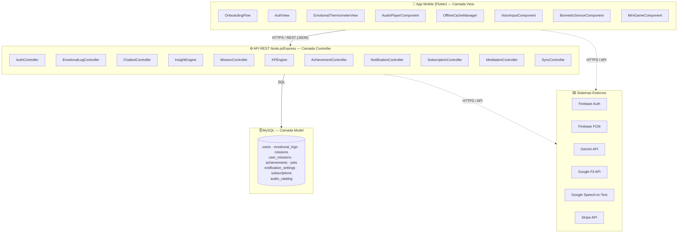
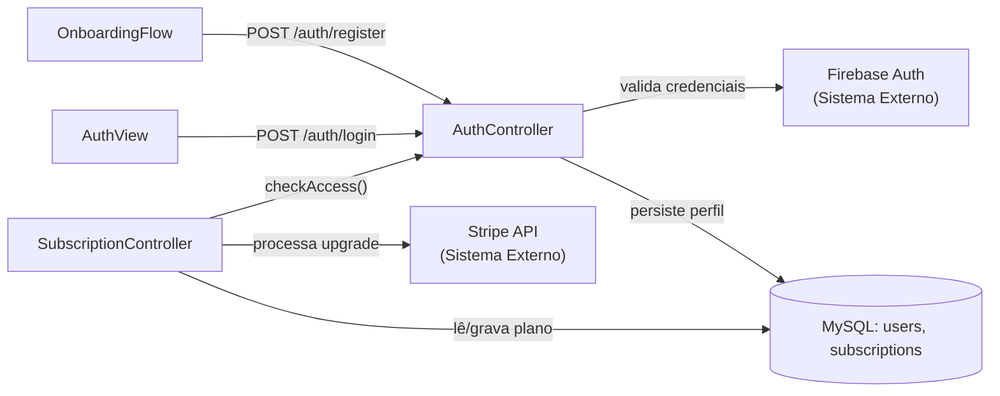
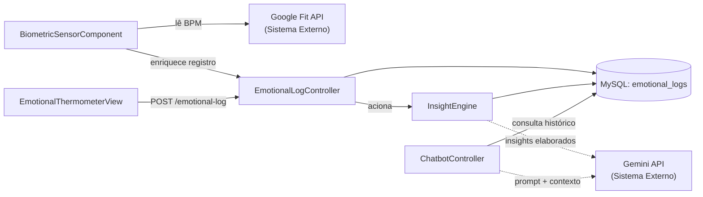
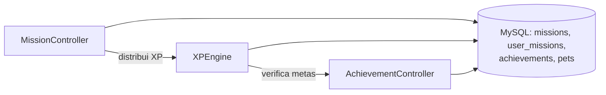
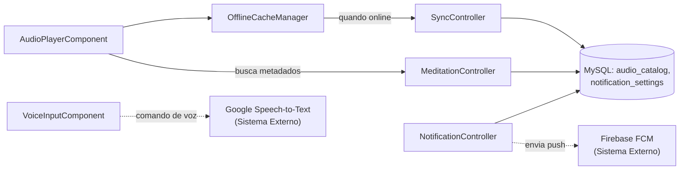

<div align="center">

# 🧩 DIAGRAMA DE COMPONENTES C4: SLOW DOWN
*Nível 3 — Arquitetura de Componentes — Engenharia de Software A*


<br><br>

| Campo | Informação |
|:---|:---|
| **Responsáveis** | Nádia Leão |
| **Projeto** | SlowDown |
| **Nível C4** | Componentes (Nível 3) |
| **Status da Entrega** | Concluído |

</div>

---

## 1. OBJETIVO DO NÍVEL DE COMPONENTES

O **Diagrama de Componentes** representa o **Nível 3** do modelo C4. Neste nível, "abrimos" cada container identificado no Nível 2 para expor seus módulos internos: os **componentes** que compõem cada container, suas responsabilidades individuais e como se comunicam entre si.

Os componentes estão alinhados com:
- O **padrão MVC** adotado no TP2 (documento `1-padroes-arquiteturais.md`)
- As **Histórias de Usuário** definidas no TP1 (documento `3_backlog-do-produto.md`)
- Os **sistemas externos** identificados no Diagrama de Contexto (documento `3-c4-contexto.md`)

---

## 2. VISÃO GERAL DOS CONTAINERS E SEUS COMPONENTES

O SlowDown é composto por três containers internos. Este documento detalha os componentes de cada um.

```
┌─────────────────────────────────────────────────────────────────────┐
│                          SLOW DOWN                                  │
│                                                                     │
│  ┌──────────────────┐  ┌──────────────────┐  ┌──────────────────┐  │
│  │   APP MOBILE     │  │   API REST       │  │   BANCO DE       │  │
│  │   (Flutter)      │  │  (Node + Express)│  │   DADOS (MySQL)  │  │
│  │                  │  │                  │  │                  │  │
│  │  8 componentes   │  │  11 componentes  │  │  8 entidades     │  │
│  └──────────────────┘  └──────────────────┘  └──────────────────┘  │
└─────────────────────────────────────────────────────────────────────┘
```

---

## 3. COMPONENTES DO APP MOBILE (Flutter)

O App Mobile é o container responsável pela **interface com o usuário**. Na arquitetura MVC, representa a camada **View** — mas também contém componentes de suporte offline e integração com hardware do dispositivo.

### 3.1 Componentes

#### 📱 OnboardingFlow
- **Responsabilidade:** Conduz o usuário por um fluxo guiado na primeira instalação, apresentando as funcionalidades do app e coletando preferências iniciais de perfil.
- **HU relacionada:** US-14
- **Comunica-se com:** `AuthController` (API REST), para criar a conta durante o onboarding.

---

#### 🔐 AuthView
- **Responsabilidade:** Telas de login e cadastro. Captura credenciais do usuário e exibe feedbacks de autenticação (erro, sucesso, carregamento).
- **HU relacionada:** US-16
- **Comunica-se com:** `AuthController` (API REST) via `POST /auth/login` e `POST /auth/register`.

---

#### 🌡️ EmotionalThermometerView
- **Responsabilidade:** Interface do termômetro emocional diário. Permite ao usuário selecionar seu estado emocional atual em uma escala visual interativa.
- **HU relacionada:** US-06
- **Comunica-se com:** `EmotionalLogController` (API REST) via `POST /emotional-log`.

---

#### 🎵 AudioPlayerComponent
- **Responsabilidade:** Reprodução de áudios de meditação e paisagens sonoras. Suporta configuração de duração e locutor, e serve arquivos tanto do servidor quanto do cache local (modo offline).
- **HUs relacionadas:** US-01, US-18, US-19
- **Comunica-se com:** `OfflineCacheManager` (local) e `MeditationController` (API REST).

---

#### 💾 OfflineCacheManager
- **Responsabilidade:** Gerencia o armazenamento local de arquivos de áudio e dados essenciais do usuário. Detecta ausência de conexão e serve conteúdo do cache. Mantém uma fila de sincronização para enviar dados pendentes quando a conexão é restaurada.
- **HUs relacionadas:** US-02, US-18, US-19
- **Comunica-se com:** `SyncController` (API REST, quando online); sistema de arquivos local do dispositivo.

---

#### 🎤 VoiceInputComponent
- **Responsabilidade:** Captura comandos de voz do usuário, encaminha o áudio à **Google Speech-to-Text API** e converte o resultado em ações de navegação dentro do app.
- **HU relacionada:** US-05
- **Comunica-se com:** Google Speech-to-Text API (sistema externo); roteador de navegação do Flutter.

---

#### 💓 BiometricSensorComponent
- **Responsabilidade:** Lê dados biométricos (especialmente BPM — batimentos por minuto) a partir da **Google Fit API**, que acessa os sensores nativos do dispositivo Android.
- **HU relacionada:** US-04
- **Comunica-se com:** Google Fit API (sistema externo); `EmotionalLogController` (API REST) para enriquecer os registros emocionais com dados biométricos.

---

#### 🎮 MiniGameComponent
- **Responsabilidade:** Oferece mini games simples de alívio de estresse durante pausas do usuário. Cada jogo concluído pode ser registrado como atividade de autocuidado, integrando-se ao sistema de missões e XP.
- **HU relacionada:** US-09
- **Comunica-se com:** `MissionController` (API REST), para registrar a conclusão do mini game e acionar a distribuição de XP quando aplicável.

---

## 4. COMPONENTES DA API REST (Node.js + Express)

A API REST é o container que representa a camada **Controller** na arquitetura MVC. É o núcleo lógico do sistema: valida sessões, aplica regras de negócio e coordena integrações com sistemas externos e com o banco de dados.

### 4.1 Componentes

#### 🔑 AuthController
- **Responsabilidade:** Gerencia o fluxo completo de autenticação — criação de conta, login, validação de sessão e geração de tokens JWT. Integra-se ao Firebase Auth para não armazenar senhas em texto puro.
- **HU relacionada:** US-16
- **Comunica-se com:** Firebase Auth (sistema externo); `UserModel` (MySQL).

---

#### 😟 EmotionalLogController
- **Responsabilidade:** Recebe, valida e persiste os registros emocionais diários dos usuários. Também aciona o `InsightEngine` quando um novo registro é salvo, para gerar insights personalizados.
- **HU relacionada:** US-06, US-07
- **Comunica-se com:** MySQL (tabela `emotional_logs`); `InsightEngine`.

---

#### 🤖 ChatbotController
- **Responsabilidade:** Processa as interações conversacionais com o chatbot. Monta o prompt com o contexto emocional recente do usuário e envia à **Gemini API**, formatando a resposta para exibição no App.
- **HUs relacionadas:** US-07, US-08
- **Comunica-se com:** Gemini API (sistema externo); MySQL (histórico emocional do usuário).

---

#### 💡 InsightEngine
- **Responsabilidade:** Analisa os registros emocionais recentes do usuário e gera insights automáticos sobre padrões de estresse. Pode acionar a Gemini API para insights mais elaborados.
- **HU relacionada:** US-07
- **Comunica-se com:** MySQL (tabela `emotional_logs`); Gemini API (sistema externo, quando necessário).

---

#### 🎮 MissionController
- **Responsabilidade:** Gerencia o ciclo de vida das missões diárias de autocuidado — listagem, conclusão, distribuição de XP e desbloqueio de recompensas para o pet virtual.
- **HU relacionada:** US-13
- **Comunica-se com:** MySQL (tabelas `missions`, `user_missions`); `XPEngine`.

---

#### ⭐ XPEngine
- **Responsabilidade:** Calcula e atualiza os pontos de experiência (XP) do usuário, gerencia o nível de evolução do pet virtual e verifica as condições de desbloqueio de emblemas e itens visuais.
- **HUs relacionadas:** US-12, US-13
- **Comunica-se com:** MySQL (tabelas `users`, `pets`, `achievements`); `AchievementController`.

---

#### 🏆 AchievementController
- **Responsabilidade:** Verifica se o usuário atingiu as metas necessárias para ganhar emblemas digitais e registra as conquistas no banco de dados.
- **HU relacionada:** US-12
- **Comunica-se com:** MySQL (tabela `achievements`); `XPEngine`.

---

#### 🔔 NotificationController
- **Responsabilidade:** Persiste as preferências de notificação do usuário e programa o envio de alertas e lembretes via **Firebase FCM**, tanto para lembretes de bem-estar quanto para alertas de frequência cardíaca elevada.
- **HUs relacionadas:** US-11, US-15
- **Comunica-se com:** Firebase FCM (sistema externo); MySQL (tabela `notification_settings`).

---

#### 💳 SubscriptionController
- **Responsabilidade:** Gerencia o estado de assinatura do usuário (plano Padrão ou Premium), processa upgrades via **Stripe API** e controla o acesso a funcionalidades exclusivas do plano Premium.
- **HU relacionada:** US-17
- **Comunica-se com:** Stripe API (sistema externo); MySQL (tabela `subscriptions`).

---

#### 🧘 MeditationController
- **Responsabilidade:** Gerencia o catálogo de sessões de meditação e paisagens sonoras, fornecendo ao `AudioPlayerComponent` os metadados necessários (duração, locutor, tipo) para configurar a reprodução. Verifica junto ao `SubscriptionController` se o conteúdo solicitado requer plano Premium.
- **HUs relacionadas:** US-01, US-18
- **Comunica-se com:** MySQL (tabela `audio_catalog`); `SubscriptionController`.

---

#### 🔄 SyncController
- **Responsabilidade:** Recebe os dados acumulados localmente pelo `OfflineCacheManager` durante períodos sem conexão (registros emocionais, progresso de missões, XP, estado do pet) e os persiste no MySQL quando a conexão é restaurada, garantindo a consistência entre o estado local e o estado do servidor.
- **HU relacionada:** US-19
- **Comunica-se com:** `OfflineCacheManager` (App Mobile); MySQL (tabelas `emotional_logs`, `user_missions`, `pets`).

> **Nota de consistência:** os componentes `MeditationController` e `SyncController` foram incorporados a este nível porque já eram referenciados na Seção 6 (Diagrama) e no documento `7-rastreabilidade.md` (US-01, US-02, US-18, US-19), mas não constavam na lista original de componentes da API REST. Essa correção alinha o diagrama com o texto e com a matriz de rastreabilidade.

---

## 5. ENTIDADES DO BANCO DE DADOS (MySQL)

O MySQL representa a camada **Model** na arquitetura MVC. Armazena todos os dados estruturados do sistema com integridade referencial garantida.

| Entidade (Tabela) | Responsabilidade | HUs Relacionadas |
|:---|:---|:---|
| `users` | Perfis, credenciais e configurações dos usuários | US-16, US-17 |
| `emotional_logs` | Histórico de registros emocionais diários e dados biométricos | US-06, US-07, US-10 |
| `missions` / `user_missions` | Catálogo de missões e progresso individual por usuário | US-13 |
| `achievements` | Emblemas conquistados e critérios de desbloqueio | US-12 |
| `pets` | Estado atual do pet virtual (nome, nível, itens equipados) | US-03, US-13 |
| `notification_settings` | Preferências de horário e tipo de notificação por usuário | US-15 |
| `subscriptions` | Status do plano (Padrão/Premium) e histórico de pagamentos | US-17 |
| `audio_catalog` | Metadados das sessões de meditação e paisagens sonoras | US-01, US-18 |

---

## 6. DIAGRAMA DE COMPONENTES C4

### 6.1 Visão geral do diagrama

Antes de detalhar cada agrupamento de componentes, a **Figura 1** apresenta uma visão geral da arquitetura interna do SlowDown: os três containers (App Mobile, API REST e MySQL) e os sistemas externos com os quais a API REST e o App Mobile se comunicam. O objetivo desta figura é situar o leitor sobre **onde** cada componente "mora" antes de detalhar **como** eles se conectam entre si.



**Figura 1 — Visão geral dos componentes do SlowDown, organizados pelos três containers (App Mobile, API REST, MySQL) e pelos sistemas externos integrados.**

A partir desta visão geral, a comunicação entre App Mobile e API REST ocorre sempre via **HTTPS/REST (JSON)**, a API REST acessa o MySQL via **SQL**, e tanto a API REST quanto componentes específicos do App Mobile (como `VoiceInputComponent` e `BiometricSensorComponent`) consomem diretamente APIs de terceiros. As subseções a seguir detalham cada um desses agrupamentos.

---

### 6.2 Detalhamento por partes

#### Parte 1 — Identidade, Acesso e Assinaturas

Este agrupamento cobre o fluxo de criação de conta, login e gerenciamento do plano (Padrão/Premium), que é pré-requisito para o uso das demais funcionalidades do app.



**Figura 2 — Componentes de Identidade, Acesso e Assinaturas. `OnboardingFlow` e `AuthView` acionam o `AuthController`, que valida credenciais no Firebase Auth e persiste o perfil em `users`; o `SubscriptionController` gerencia o plano do usuário junto à Stripe API e à tabela `subscriptions`.**

Esse fluxo sustenta as US-14 (onboarding), US-16 (criar conta/login) e US-17 (assinatura Premium). O `SubscriptionController` é consultado pelos demais componentes (via `checkAccess()`) sempre que uma funcionalidade exclusiva do plano Premium é solicitada, como download offline (US-02) e áudios especiais (US-18).

---

#### Parte 2 — Bem-estar Emocional e Inteligência Artificial

Este agrupamento concentra o "coração" funcional do SlowDown: o registro emocional diário, o cruzamento com dados biométricos e a geração de insights e respostas via Gemini API.



**Figura 3 — Componentes de Bem-estar Emocional e IA. O `EmotionalThermometerView` e o `BiometricSensorComponent` alimentam o `EmotionalLogController`, que persiste em `emotional_logs` e aciona o `InsightEngine`; o `ChatbotController` consulta o mesmo histórico e consome a Gemini API para gerar respostas personalizadas.**

Este agrupamento atende diretamente às US-04 (monitoramento de frequência cardíaca), US-06 (registro emocional diário), US-07 (insights personalizados) e US-08 (chatbot de incentivo). A separação entre `InsightEngine` (análise automática) e `ChatbotController` (interação conversacional) permite que ambos compartilhem o mesmo histórico em `emotional_logs` sem duplicar lógica de acesso a dados.

---

#### Parte 3 — Gamificação (Pet Virtual, Missões, XP e Conquistas)

Este agrupamento implementa o sistema de engajamento gamificado do SlowDown, que recompensa o uso contínuo do app com experiência (XP), evolução do pet virtual e emblemas.



**Figura 4 — Componentes de Gamificação. O `MissionController` gerencia o ciclo das missões e aciona o `XPEngine`, que atualiza o nível do pet em `pets` e repassa ao `AchievementController` a verificação de novos emblemas em `achievements`.**

Este agrupamento sustenta as US-03 (personalização do pet), US-12 (emblemas digitais) e US-13 (missões diárias e XP). A cadeia `MissionController → XPEngine → AchievementController` reflete a regra de negócio: completar uma missão pode, em sequência, elevar o nível do pet e desbloquear uma conquista.

---

#### Parte 4 — Conteúdo de Áudio, Modo Offline, Sensores e Notificações

Este agrupamento reúne os componentes responsáveis pela experiência de áudio (incluindo modo offline), pela entrada por voz e pelas notificações push — funcionalidades centrais para o público-alvo do SlowDown, que pode estar em áreas com conectividade limitada.



**Figura 5 — Componentes de Conteúdo de Áudio, Offline, Sensores e Notificações. O `AudioPlayerComponent` reproduz conteúdo via `OfflineCacheManager` (local) ou `MeditationController` (servidor); o `OfflineCacheManager` sincroniza dados pendentes através do `SyncController` quando a conexão é restaurada; `VoiceInputComponent` consome a Google Speech-to-Text e o `NotificationController` dispara alertas via Firebase FCM.**

Este agrupamento atende às US-01 e US-18 (sessões de meditação e áudio), US-02 e US-19 (modo offline), US-05 (comandos de voz) e US-11/US-15 (notificações). O `OfflineCacheManager` é o componente de maior impacto arquitetural do sistema, pois garante que registros emocionais, progresso de missões e reprodução de áudio continuem funcionando sem conexão, sincronizando-se posteriormente via `SyncController`.

---

### 6.3 Legenda

| Elemento | Descrição |
|:---|:---|
| 🟦 **Subgrafo "App Mobile"** | Componentes da camada de apresentação (View), executados no dispositivo do usuário |
| 🔵 **Subgrafo "API REST"** | Componentes da camada de controle (Controller), executados no servidor |
| 🗄️ **Nó cilíndrico** | Tabelas/entidades persistidas no MySQL (camada Model) |
| 🟨 **Subgrafo "Sistemas Externos"** | Serviços de terceiros integrados ao SlowDown |
| **Seta sólida (`-->`)** | Chamada direta entre componentes internos do SlowDown (API interna ou SQL) |
| **Seta pontilhada (`-.->`)** | Integração com sistema externo via HTTPS/API |

---

<div align="center">

<sub>Desenvolvido para a disciplina de Engenharia de Software A · ICET/UFAM<br>
Professor: Dr. Andrey Rodrigues</sub>

</div>
