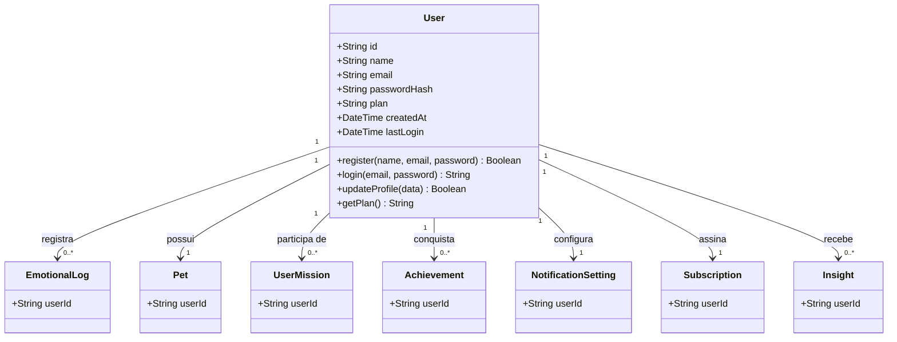
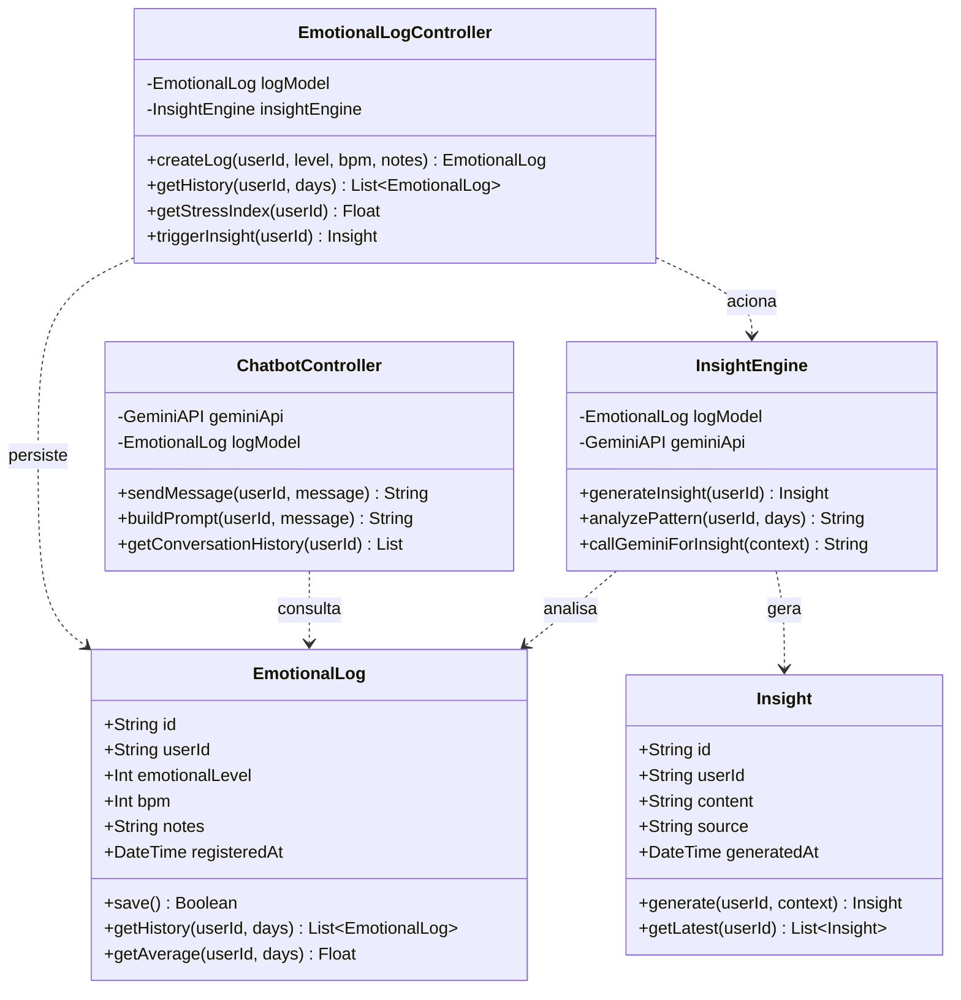

# 🏗️ DIAGRAMA DE CÓDIGO (ESTRUTURAL) C4: SLOW DOWN
### Nível 4 — Diagrama de Classes UML

 

| Campo | Informação |
|:---|:---|
| **Responsáveis** | Nádia Leão |
| **Projeto** | SlowDown |
| **Nível C4** | Código / Estrutural (Nível 4) |
| **Artefato** | Diagrama de Classes UML |
| **Status da Entrega** | Concluído |

---

# 📖 1. OBJETIVO

O **Diagrama de Código (Nível 4 do Modelo C4)** representa a visão mais detalhada da arquitetura do sistema **SlowDown**, descrevendo a estrutura interna do domínio por meio de um **Diagrama de Classes UML**.

Neste nível são apresentados:

- As principais entidades do sistema;
- Os atributos e operações de cada classe;
- As regras de negócio encapsuladas nos modelos;
- Os relacionamentos e multiplicidades entre os objetos;
- A organização lógica do domínio da aplicação.

O objetivo deste artefato é demonstrar como os requisitos funcionais definidos no backlog foram traduzidos em uma estrutura de software consistente, escalável e alinhada aos princípios de orientação a objetos.

---

# 🖼️ 2. VISÃO GERAL DO DIAGRAMA

## Figura 1 — Diagrama de Classes UML Completo

**Figura 1 — Diagrama de Classes UML completo do domínio do SlowDown.**

O diagrama apresenta a modelagem estrutural das principais funcionalidades do sistema, organizadas em módulos de domínio responsáveis por autenticação, monitoramento emocional, análise de estresse, gamificação, conteúdo de meditação, notificações e assistência conversacional.

A arquitetura evidencia a centralidade da entidade **Usuário**, que atua como ponto de integração entre os diferentes componentes do sistema.

---

# 🧩 3. VISÃO GERAL DOS MÓDULOS

| Módulo | Responsabilidade |
|---------|------------------|
| 🔐 Autenticação | Cadastro, login e gerenciamento de sessões |
| 👤 Perfil do Usuário | Preferências, acessibilidade e personalização |
| 💳 Assinaturas | Controle de planos e recursos premium |
| 😊 Bem-estar Emocional | Registro diário de emoções |
| ❤️ Monitoramento Cardíaco | Coleta e análise de BPM |
| 📊 Inteligência Analítica | Cálculo de estresse e geração de relatórios |
| 🎯 Gamificação | Missões, pet virtual e conquistas |
| 🤖 Assistente Conversacional | Chatbot de apoio emocional |
| 🎧 Conteúdo Guiado | Meditações e acompanhamento de sessões |
| 🔔 Notificações | Alertas e lembretes personalizados |

---

# 👤 4. USUÁRIO COMO CENTRO DO DOMÍNIO

A classe `Usuario` representa a principal entidade do sistema e funciona como agregadora dos demais módulos.

Através dela, o usuário pode:

- Gerenciar sua conta;
- Configurar preferências pessoais;
- Registrar estados emocionais;
- Acompanhar indicadores de estresse;
- Participar de missões;
- Evoluir seu pet virtual;
- Utilizar o chatbot;
- Consumir conteúdos de meditação;
- Receber notificações;
- Gerenciar sua assinatura.

A maioria das entidades do sistema possui relacionamento direto ou indireto com `Usuario`, evidenciando seu papel central dentro da modelagem.

---

# 🔐 5. AUTENTICAÇÃO E CONTROLE DE ACESSO

O módulo de autenticação é composto pelas classes:

- `Usuario`
- `SessaoAutenticacao`
- `Assinatura`

## Usuario

Responsável pela identidade digital do usuário.

### Principais funcionalidades

- Cadastro tradicional;
- Cadastro via Google OAuth;
- Recuperação de senha;
- Validação de força de senha;
- Ativação e desativação de conta.

## SessaoAutenticacao

Responsável pelo gerenciamento das sessões ativas.

### Funcionalidades

- Emissão de JWT;
- Renovação de tokens;
- Revogação de acesso;
- Controle de expiração;
- Validação de sessão.

## Assinatura

Responsável pelo gerenciamento dos planos disponíveis na plataforma.

### Funcionalidades

- Confirmação de pagamento;
- Cancelamento;
- Verificação de acesso premium;
- Processamento de expiração;
- Integração com gateway de pagamento.

---

# ⚙️ 6. PERFIL E PERSONALIZAÇÃO

A classe `Perfil` concentra as preferências e configurações individuais do usuário.

## Recursos disponíveis

- Configuração de estilo de orientação;
- Ajustes de acessibilidade;
- Controle de onboarding;
- Definição de limites personalizados de BPM;
- Configurações de experiência.

### Estilos suportados

- Bíblico
- Psicológico
- Motivacional

Essas preferências influenciam diretamente a experiência do usuário dentro da aplicação.

---

# 😊 7. REGISTRO EMOCIONAL

O monitoramento emocional é realizado pela classe `RegistroEmocional`.

Cada registro pode ser realizado utilizando diferentes métodos de entrada:

- Número;
- Emoji;
- Cor.

Os valores são convertidos para uma escala padronizada de 1 a 10, permitindo análises históricas e comparações ao longo do tempo.

## Principais funcionalidades

- Registro diário de humor;
- Atualização do estado emocional;
- Inclusão de observações;
- Sincronização em nuvem;
- Verificação de registros duplicados.

---

# ❤️ 8. MONITORAMENTO CARDÍACO

A classe `LeituraCardiaca` representa as leituras de frequência cardíaca capturadas pelo dispositivo.

## Dados armazenados

- Valor BPM;
- Momento da coleta;
- Contexto da leitura;
- Estado de anomalia;
- Alertas disparados.

## Funcionalidades

- Coleta contínua;
- Identificação de anomalias;
- Emissão de alertas;
- Cálculo de médias periódicas.

Esses dados são utilizados posteriormente para cálculo dos indicadores emocionais.

---

# 📊 9. ÍNDICE DE ESTRESSE E RELATÓRIOS

## Índice de Estresse

A classe `IndiceEstresse` consolida dados emocionais e fisiológicos.

### Critérios de cálculo

| Fonte | Contribuição |
|---------|-------------|
| Registro emocional | 60% |
| Frequência cardíaca | 40% |

O resultado permite:

- Detectar períodos críticos;
- Identificar padrões de comportamento;
- Apoiar recomendações futuras;
- Alimentar relatórios analíticos.

---

## Relatórios

A classe `Relatorio` gera análises históricas da evolução do usuário.

### Períodos disponíveis

- 7 dias;
- 14 dias;
- 30 dias.

### Recursos

- Exportação PDF (Premium);
- Texto alternativo para acessibilidade;
- Histórico de picos de estresse;
- Estatísticas consolidadas.

---

# 🎯 10. GAMIFICAÇÃO

O sistema utiliza técnicas de gamificação para incentivar hábitos saudáveis.

As principais entidades envolvidas são:

- `Missao`
- `Pet`
- `EmblemaDigital`

---

## Missões

As missões representam desafios de autocuidado realizados pelo usuário.

### Tipos

- Simples
- Avançada

Cada missão concluída gera experiência para progressão do usuário.

---

## Pet Virtual

O pet funciona como representação visual do progresso alcançado.

### Características

- Evolução por níveis;
- Controle de felicidade;
- Renomeação limitada;
- Penalização por inatividade.

A evolução do pet está diretamente relacionada ao engajamento do usuário.

---

## Emblemas Digitais

Representam conquistas obtidas ao longo da jornada.

### Categorias

- Básico
- Premium

Os emblemas são desbloqueados automaticamente quando determinadas metas são alcançadas.

---

# 🤖 11. ASSISTENTE CONVERSACIONAL

O módulo conversacional é composto pelas classes:

- `Conversa`
- `Mensagem`

Seu objetivo é oferecer apoio emocional e acompanhamento contínuo ao usuário.

## Funcionalidades

- Histórico de conversas;
- Registro de mensagens;
- Personalização do estilo de orientação;
- Detecção de situações de risco;
- Acionamento de protocolos de crise.

---

## Detecção de Crise

A classe `Mensagem` possui mecanismos especializados para identificar sinais de vulnerabilidade emocional.

Entre eles:

- Hard Match;
- Soft Match NLP;
- Score de confiança;
- Detecção de gatilhos críticos.

Quando necessário, o sistema pode exibir recursos de apoio imediato.

---

# 🎧 12. MEDITAÇÃO E CONTEÚDO GUIADO

O módulo de conteúdo é composto pelas classes:

- `Meditacao`
- `Locutor`
- `ProgressoSessao`

## Recursos disponíveis

- Reprodução em segundo plano;
- Diferentes durações;
- Controle de progresso;
- Continuação de sessões interrompidas;
- Disponibilidade offline para usuários Premium.

Cada conteúdo pode ser associado a um locutor específico, permitindo personalização da experiência.

---

# 🔔 13. NOTIFICAÇÕES

A classe `Notificacao` gerencia os lembretes e interações automáticas do sistema.

## Categorias

- Lembrete de prática;
- Missão diária;
- Evolução de progresso;
- Interações do sistema.

## Funcionalidades

- Agendamento;
- Cancelamento;
- Agrupamento de notificações;
- Controle de envio.

Esses mecanismos auxiliam na manutenção do engajamento dos usuários.

---

# 🔗 14. PRINCIPAIS RELACIONAMENTOS

Os relacionamentos mais relevantes observados no diagrama são:

| Origem | Destino | Cardinalidade |
|----------|----------|----------|
| Usuario | Perfil | 1 : 1 |
| Usuario | Assinatura | 1 : 1 |
| Usuario | SessaoAutenticacao | 1 : N |
| Usuario | RegistroEmocional | 1 : N |
| Usuario | LeituraCardiaca | 1 : N |
| Usuario | Conversa | 1 : N |
| Usuario | Notificacao | 1 : N |
| Usuario | Relatorio | 1 : N |
| Usuario | Pet | 1 : 1 |
| Usuario | Missao | N : N |
| Usuario | EmblemaDigital | N : N |

Essas associações demonstram que a entidade `Usuario` atua como núcleo agregador de informações e comportamentos da plataforma.

---

# ✅ 15. CONCLUSÃO

O Diagrama de Classes UML do **SlowDown** apresenta uma modelagem abrangente e alinhada aos requisitos definidos para a aplicação.

A estrutura contempla funcionalidades de autenticação, monitoramento emocional, análise fisiológica, gamificação, suporte conversacional e consumo de conteúdo guiado, fornecendo uma base sólida para implementação, manutenção e evolução futura do sistema.

Além de representar a arquitetura interna do software, o diagrama também estabelece a rastreabilidade entre os requisitos de negócio e os componentes responsáveis por sua execução.

---

Desenvolvido para a disciplina de Engenharia de Software A · ICET/UFAM 
Professor: Dr. Andrey Rodrigues

| `UserMission` | Model | Progresso de um usuário em uma missão específica |
| `Achievement` | Model | Emblema conquistado por um usuário |
| `Pet` | Model | Estado do pet virtual associado ao usuário |
| `AudioContent` | Model | Metadados de sessão de meditação ou paisagem sonora |
| `NotificationSetting` | Model | Preferências de notificação de um usuário |
| `Subscription` | Model | Status de assinatura e plano do usuário |
| `AuthController` | Controller | Fluxo de autenticação e sessão |
| `EmotionalLogController` | Controller | Registro e consulta de estados emocionais |
| `ChatbotController` | Controller | Interação com o chatbot via Gemini API |
| `MissionController` | Controller | Ciclo de vida de missões e distribuição de XP |
| `XPEngine` | Controller | Cálculo de XP e evolução do pet |

---

## 3. DIAGRAMA DE CLASSES UML — VISÃO GERAL

### 3.1 Visão geral do diagrama

A **Figura 1** apresenta o diagrama de classes completo do núcleo de domínio do SlowDown. Ele reúne as **10 classes de Model** (entidades persistidas no MySQL) e as **7 classes de Controller** (componentes identificados no Nível 3), evidenciando como `User` atua como ponto de convergência de praticamente todas as entidades do sistema, e como os controllers se relacionam com os models por **associação de uso** (dependência), nunca por herança — refletindo o padrão MVC adotado.

Antes de detalhar partes específicas (Seção 4), recomenda-se uma leitura geral: do lado esquerdo/centro estão as classes de **Model**, todas gravitando em torno de `User`; do lado direito estão as classes de **Controller**, que orquestram a lógica de negócio e dependem das classes de Model para ler e persistir dados.

```mermaid
classDiagram

    %% ─────────────────────────────────────────────
    %% CLASSES DE MODELO (ENTIDADES DE DOMÍNIO)
    %% ─────────────────────────────────────────────

    class User {
        +String id
        +String name
        +String email
        +String passwordHash
        +String plan
        +DateTime createdAt
        +DateTime lastLogin
        +register(name, email, password) Boolean
        +login(email, password) String
        +updateProfile(data) Boolean
        +getPlan() String
    }

    class EmotionalLog {
        +String id
        +String userId
        +Int emotionalLevel
        +Int bpm
        +String notes
        +DateTime registeredAt
        +save() Boolean
        +getHistory(userId, days) List~EmotionalLog~
        +getAverage(userId, days) Float
    }

    class Insight {
        +String id
        +String userId
        +String content
        +String source
        +DateTime generatedAt
        +generate(userId, context) Insight
        +getLatest(userId) List~Insight~
    }

    class Mission {
        +String id
        +String title
        +String description
        +String category
        +Int xpReward
        +Boolean isPremium
        +listAvailable(plan) List~Mission~
        +getById(id) Mission
    }

    class UserMission {
        +String id
        +String userId
        +String missionId
        +String status
        +DateTime startedAt
        +DateTime completedAt
        +start(userId, missionId) Boolean
        +complete(userId, missionId) Boolean
        +getProgress(userId) List~UserMission~
    }

    class Achievement {
        +String id
        +String userId
        +String title
        +String description
        +String badgeUrl
        +DateTime unlockedAt
        +unlock(userId, achievementId) Boolean
        +getByUser(userId) List~Achievement~
    }

    class Pet {
        +String id
        +String userId
        +String name
        +Int level
        +Int currentXP
        +String equippedItem
        +rename(name) Boolean
        +addXP(amount) Boolean
        +levelUp() Boolean
        +equipItem(itemId) Boolean
        +getState(userId) Pet
    }

    class AudioContent {
        +String id
        +String title
        +String type
        +String narrator
        +Int durationSeconds
        +String audioUrl
        +Boolean isPremium
        +listByType(type, plan) List~AudioContent~
        +getById(id) AudioContent
    }

    class NotificationSetting {
        +String id
        +String userId
        +String type
        +String scheduledTime
        +Boolean isEnabled
        +save(userId, settings) Boolean
        +getByUser(userId) NotificationSetting
        +toggle(userId, type, enabled) Boolean
    }

    class Subscription {
        +String id
        +String userId
        +String plan
        +String status
        +DateTime startDate
        +DateTime endDate
        +String stripeCustomerId
        +upgrade(userId, plan) Boolean
        +cancel(userId) Boolean
        +getStatus(userId) Subscription
        +isActive(userId) Boolean
    }

    %% ─────────────────────────────────────────────
    %% CLASSES DE CONTROLE (CONTROLLERS)
    %% ─────────────────────────────────────────────

    class AuthController {
        -FirebaseAuth firebaseAuth
        +register(name, email, password) String
        +login(email, password) String
        +logout(userId) Boolean
        +validateToken(token) Boolean
        +refreshToken(token) String
    }

    class EmotionalLogController {
        -EmotionalLog logModel
        -InsightEngine insightEngine
        +createLog(userId, level, bpm, notes) EmotionalLog
        +getHistory(userId, days) List~EmotionalLog~
        +getStressIndex(userId) Float
        +triggerInsight(userId) Insight
    }

    class ChatbotController {
        -GeminiAPI geminiApi
        -EmotionalLog logModel
        +sendMessage(userId, message) String
        +buildPrompt(userId, message) String
        +getConversationHistory(userId) List
    }

    class InsightEngine {
        -EmotionalLog logModel
        -GeminiAPI geminiApi
        +generateInsight(userId) Insight
        +analyzePattern(userId, days) String
        +callGeminiForInsight(context) String
    }

    class MissionController {
        -Mission missionModel
        -UserMission userMissionModel
        -XPEngine xpEngine
        +listMissions(userId) List~Mission~
        +startMission(userId, missionId) Boolean
        +completeMission(userId, missionId) Boolean
        +getDailyProgress(userId) List~UserMission~
    }

    class XPEngine {
        -Pet petModel
        -Achievement achievementModel
        +addXP(userId, amount) Boolean
        +checkLevelUp(userId) Boolean
        +checkAchievements(userId) List~Achievement~
        +getLevel(userId) Int
    }

    class NotificationController {
        -NotificationSetting settingModel
        -FCMService fcmService
        +saveSettings(userId, settings) Boolean
        +scheduleNotification(userId, type, time) Boolean
        +sendPushNotification(userId, message) Boolean
        +cancelNotification(userId, type) Boolean
    }

    class SubscriptionController {
        -Subscription subscriptionModel
        -StripeAPI stripeApi
        +getPlans() List
        +upgrade(userId, planId) Boolean
        +cancelSubscription(userId) Boolean
        +checkAccess(userId, feature) Boolean
    }

    %% ─────────────────────────────────────────────
    %% RELACIONAMENTOS
    %% ─────────────────────────────────────────────

    %% User como centro do domínio
    User "1" --> "0..*" EmotionalLog : registra
    User "1" --> "1" Pet : possui
    User "1" --> "0..*" UserMission : participa de
    User "1" --> "0..*" Achievement : conquista
    User "1" --> "1" NotificationSetting : configura
    User "1" --> "1" Subscription : assina
    User "1" --> "0..*" Insight : recebe

    %% Mission e UserMission
    Mission "1" --> "0..*" UserMission : compõe
    UserMission "0..*" --> "1" User : pertence a

    %% Controllers e Models
    AuthController ..> User : gerencia
    EmotionalLogController ..> EmotionalLog : persiste
    EmotionalLogController ..> InsightEngine : aciona
    InsightEngine ..> EmotionalLog : analisa
    InsightEngine ..> Insight : gera
    ChatbotController ..> EmotionalLog : consulta
    MissionController ..> Mission : consulta
    MissionController ..> UserMission : atualiza
    MissionController ..> XPEngine : aciona
    XPEngine ..> Pet : evolui
    XPEngine ..> Achievement : verifica/desbloqueia
    NotificationController ..> NotificationSetting : persiste
    SubscriptionController ..> Subscription : gerencia
    SubscriptionController ..> User : verifica plano

    %% AudioContent
    AudioContent "0..*" ..> Subscription : requer plano Premium
```

**Figura 1 — Diagrama de Classes UML completo do núcleo de domínio do SlowDown, com as classes de Model (entidades persistidas) e de Controller (componentes do Nível 3) e seus relacionamentos.**

---

## 4. DETALHAMENTO POR PARTES

A Figura 1 reúne todas as classes do domínio, o que pode dificultar a leitura de fluxos específicos. As subseções abaixo recortam o diagrama geral em três visões focadas, cada uma acompanhada de uma figura específica, conforme as áreas funcionais já apresentadas no Nível 3 (`5-c4-componentes.md`).

### 4.1 Parte 1 — User como Centro do Domínio

A classe `User` é o **núcleo central** do modelo de domínio do SlowDown. Todas as entidades relevantes do sistema possuem associação direta ou indireta com ela.

**Figura 2 — `User` como centro do domínio: cada usuário registra logs emocionais, possui um pet, participa de missões, conquista emblemas, configura notificações, assina um plano e recebe insights.**

- Um `User` **registra** múltiplos `EmotionalLog` ao longo do tempo — permitindo rastrear a evolução emocional (US-06, US-10).
- Um `User` **possui** exatamente um `Pet`, que evolui conforme o usuário completa missões (US-03, US-13).
- Um `User` **participa de** múltiplas `UserMission`, que rastreiam seu progresso individual nas missões disponíveis (US-13).
- Um `User` **conquista** múltiplos `Achievement` ao atingir metas de autocuidado (US-12).
- Um `User` **configura** uma única `NotificationSetting` com suas preferências de alertas (US-15).
- Um `User` **assina** um `Subscription`, que determina o acesso a funcionalidades Premium (US-17).

---

### 4.2 Parte 2 — Bem-estar Emocional e IA (Controllers x Models)

Os **Controllers** não herdam das entidades de modelo — eles as utilizam por **dependência (associação de uso)**. Isso reflete o padrão MVC adotado: os controllers orquestram o fluxo, mas não carregam estado de domínio. Esta visão foca no fluxo de registro emocional, geração de insights e chatbot.

**Figura 3 — Fluxo de Bem-estar Emocional e IA: o `EmotionalLogController` persiste registros e aciona o `InsightEngine`, que analisa o histórico e gera `Insight`; o `ChatbotController` consulta o mesmo histórico para montar o contexto enviado à Gemini API.**

- `EmotionalLogController` cria logs e aciona o `InsightEngine`, que analisa padrões e pode chamar a Gemini API para insights mais elaborados.
- `InsightEngine` lê `EmotionalLog` e produz instâncias de `Insight`, associadas ao usuário.
- `ChatbotController` consulta o mesmo histórico de `EmotionalLog` para enriquecer o contexto enviado ao modelo de linguagem.

---

### 4.3 Parte 3 — Gamificação e Controle de Acesso Premium

Esta visão foca no ciclo de gamificação (missões → XP → pet → conquistas) e no papel da `Subscription` como guardiã de acesso a conteúdo Premium.

**Figura 4 — Gamificação e controle de acesso Premium: o `MissionController` atualiza `UserMission` e aciona o `XPEngine`, que evolui o `Pet` e verifica novas `Achievement`; o `SubscriptionController` gerencia a `Subscription`, da qual depende o acesso a `AudioContent` marcado como Premium.**

- `MissionController` gerencia o ciclo de missões e chama o `XPEngine` ao completar uma missão.
- `XPEngine` atualiza o `Pet` e verifica se novas conquistas foram desbloqueadas via `Achievement`.
- A classe `Subscription` atua como **guardiã de acesso** a funcionalidades Premium. O `SubscriptionController.checkAccess(userId, feature)` é chamado pelos demais controllers antes de liberar recursos exclusivos como download offline (US-02), missões premium e áudios especiais (US-18).

---

## 5. RASTREABILIDADE COM O BACKLOG

| Classe / Método Principal | HU Relacionada | Funcionalidade |
|:---|:---|:---|
| `User.register()` / `AuthController.register()` | US-16 | Criação de conta |
| `User.login()` / `AuthController.login()` | US-16 | Login seguro |
| `EmotionalLog.save()` / `EmotionalLogController.createLog()` | US-06 | Registro emocional |
| `InsightEngine.generateInsight()` | US-07 | Insights personalizados |
| `ChatbotController.sendMessage()` | US-08 | Chatbot de apoio |
| `Mission.listAvailable()` / `MissionController.listMissions()` | US-13 | Missões diárias |
| `UserMission.complete()` / `XPEngine.addXP()` | US-13 | Conclusão e XP |
| `XPEngine.checkAchievements()` / `Achievement.unlock()` | US-12 | Emblemas digitais |
| `Pet.addXP()` / `Pet.levelUp()` | US-03, US-13 | Evolução do pet virtual |
| `NotificationController.scheduleNotification()` | US-15 | Notificações personalizadas |
| `SubscriptionController.upgrade()` | US-17 | Assinatura Premium |
| `Subscription.isActive()` | US-02, US-17, US-18 | Controle de acesso Premium |
| `AudioContent.listByType()` | US-01, US-18 | Sessões de meditação e áudio |

---

Desenvolvido para a disciplina de Engenharia de Software A · ICET/UFAM 
Professor: Dr. Andrey Rodrigues

