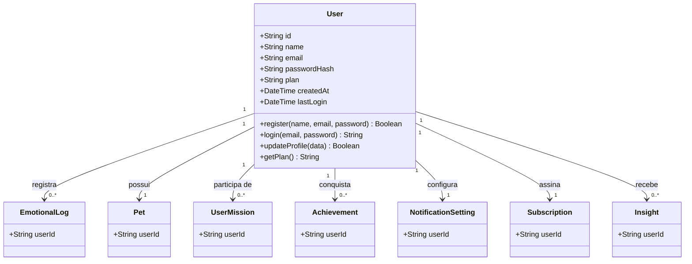
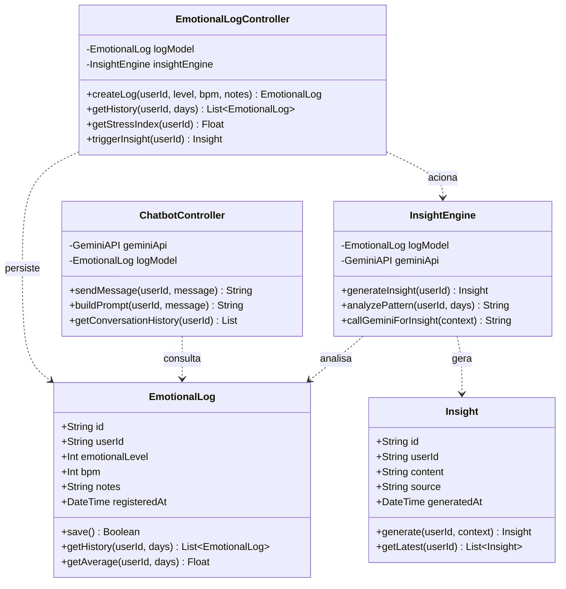
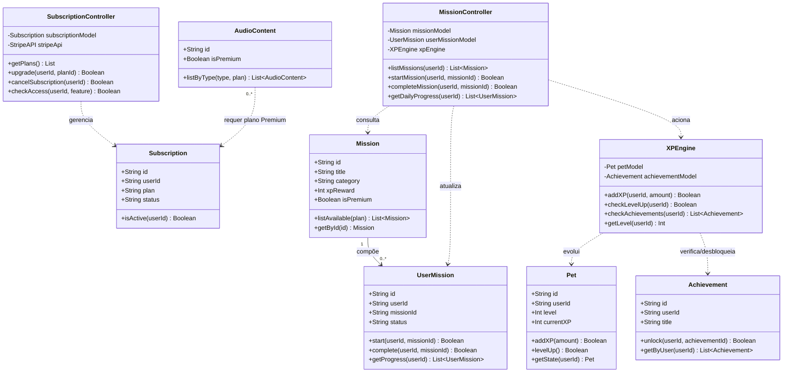

# 🏗️ DIAGRAMA DE CÓDIGO (ESTRUTURAL) C4: SLOW DOWN
*Nível 4 — Diagrama de Classes UML — Engenharia de Software A*

  

| Campo | Informação |
|:---|:---|
| **Responsáveis** | Nádia Leão |
| **Projeto** | SlowDown |
| **Nível C4** | Código / Estrutural (Nível 4) |
| **Status da Entrega** | Concluído |

---

## 1. OBJETIVO DO NÍVEL DE CÓDIGO

O **Diagrama de Código** representa o **Nível 4** do modelo C4. Neste nível, detalhamos a estrutura interna do sistema por meio de um **Diagrama de Classes UML**, que representa as principais entidades do domínio do SlowDown, seus atributos, métodos e os relacionamentos entre elas.

As classes estão diretamente alinhadas com:
- Os **componentes** identificados no Nível 3 (documento `5-c4-componentes.md`)
- As **entidades do banco de dados** (camada Model — MySQL)
- As **Histórias de Usuário** do TP1 (documento `3_backlog-do-produto.md`)

---

## 2. VISÃO GERAL DAS CLASSES PRINCIPAIS

O diagrama contempla as seguintes classes de domínio do SlowDown:

| Classe | Camada MVC | Responsabilidade Principal |
|:---|:---:|:---|
| `User` | Model | Perfil, credenciais e plano do usuário |
| `EmotionalLog` | Model | Registro emocional diário com dados biométricos |
| `Insight` | Model | Resultado gerado pelo InsightEngine para um usuário |
| `Mission` | Model | Definição de uma missão de autocuidado |
| `UserMission` | Model | Progresso de um usuário em uma missão específica |
| `Achievement` | Model | Emblema conquistado por um usuário |
| `Pet` | Model | Estado do pet virtual associado ao usuário |
| `AudioContent` | Model | Metadados de sessão de meditação ou paisagem sonora |
| `NotificationSetting` | Model | Preferências de notificação de um usuário |
| `Subscription` | Model | Status de assinatura e plano do usuário |
| `AuthController` | Controller | Fluxo de autenticação e sessão |
| `EmotionalLogController` | Controller | Registro e consulta de estados emocionais |
| `ChatbotController` | Controller | Interação com o chatbot via Gemini API |
| `MissionController` | Controller | Ciclo de vida de missões e distribuição de XP |
| `XPEngine` | Controller | Cálculo de XP e evolução do pet |

---

## 3. DIAGRAMA DE CLASSES UML — VISÃO GERAL

### 3.1 Visão geral do diagrama

A **Figura 1** apresenta o diagrama de classes completo do núcleo de domínio do SlowDown. Ele reúne as **10 classes de Model** (entidades persistidas no MySQL) e as **7 classes de Controller** (componentes identificados no Nível 3), evidenciando como `User` atua como ponto de convergência de praticamente todas as entidades do sistema, e como os controllers se relacionam com os models por **associação de uso** (dependência), nunca por herança — refletindo o padrão MVC adotado.

Antes de detalhar partes específicas (Seção 4), recomenda-se uma leitura geral: do lado esquerdo/centro estão as classes de **Model**, todas gravitando em torno de `User`; do lado direito estão as classes de **Controller**, que orquestram a lógica de negócio e dependem das classes de Model para ler e persistir dados.

**Figura 1 — Diagrama de Classes UML completo do núcleo de domínio do SlowDown, com as classes de Model (entidades persistidas) e de Controller (componentes do Nível 3) e seus relacionamentos.**

---

## 4. DETALHAMENTO POR PARTES

A Figura 1 reúne todas as classes do domínio, o que pode dificultar a leitura de fluxos específicos. As subseções abaixo recortam o diagrama geral em três visões focadas, cada uma acompanhada de uma figura específica, conforme as áreas funcionais já apresentadas no Nível 3 (`5-c4-componentes.md`).

### 4.1 Parte 1 — User como Centro do Domínio

A classe `User` é o **núcleo central** do modelo de domínio do SlowDown. Todas as entidades relevantes do sistema possuem associação direta ou indireta com ela.

**Figura 2 — `User` como centro do domínio: cada usuário registra logs emocionais, possui um pet, participa de missões, conquista emblemas, configura notificações, assina um plano e recebe insights.**

- Um `User` **registra** múltiplos `EmotionalLog` ao longo do tempo — permitindo rastrear a evolução emocional (US-06, US-10).
- Um `User` **possui** exatamente um `Pet`, que evolui conforme o usuário completa missões (US-03, US-13).
- Um `User` **participa de** múltiplas `UserMission`, que rastreiam seu progresso individual nas missões disponíveis (US-13).
- Um `User` **conquista** múltiplos `Achievement` ao atingir metas de autocuidado (US-12).
- Um `User` **configura** uma única `NotificationSetting` com suas preferências de alertas (US-15).
- Um `User` **assina** um `Subscription`, que determina o acesso a funcionalidades Premium (US-17).

---

### 4.2 Parte 2 — Bem-estar Emocional e IA (Controllers x Models)

Os **Controllers** não herdam das entidades de modelo — eles as utilizam por **dependência (associação de uso)**. Isso reflete o padrão MVC adotado: os controllers orquestram o fluxo, mas não carregam estado de domínio. Esta visão foca no fluxo de registro emocional, geração de insights e chatbot.

**Figura 3 — Fluxo de Bem-estar Emocional e IA: o `EmotionalLogController` persiste registros e aciona o `InsightEngine`, que analisa o histórico e gera `Insight`; o `ChatbotController` consulta o mesmo histórico para montar o contexto enviado à Gemini API.**

- `EmotionalLogController` cria logs e aciona o `InsightEngine`, que analisa padrões e pode chamar a Gemini API para insights mais elaborados.
- `InsightEngine` lê `EmotionalLog` e produz instâncias de `Insight`, associadas ao usuário.
- `ChatbotController` consulta o mesmo histórico de `EmotionalLog` para enriquecer o contexto enviado ao modelo de linguagem.

---

### 4.3 Parte 3 — Gamificação e Controle de Acesso Premium

Esta visão foca no ciclo de gamificação (missões → XP → pet → conquistas) e no papel da `Subscription` como guardiã de acesso a conteúdo Premium.

**Figura 4 — Gamificação e controle de acesso Premium: o `MissionController` atualiza `UserMission` e aciona o `XPEngine`, que evolui o `Pet` e verifica novas `Achievement`; o `SubscriptionController` gerencia a `Subscription`, da qual depende o acesso a `AudioContent` marcado como Premium.**

- `MissionController` gerencia o ciclo de missões e chama o `XPEngine` ao completar uma missão.
- `XPEngine` atualiza o `Pet` e verifica se novas conquistas foram desbloqueadas via `Achievement`.
- A classe `Subscription` atua como **guardiã de acesso** a funcionalidades Premium. O `SubscriptionController.checkAccess(userId, feature)` é chamado pelos demais controllers antes de liberar recursos exclusivos como download offline (US-02), missões premium e áudios especiais (US-18).

---

## 5. RASTREABILIDADE COM O BACKLOG

| Classe / Método Principal | HU Relacionada | Funcionalidade |
|:---|:---|:---|
| `User.register()` / `AuthController.register()` | US-16 | Criação de conta |
| `User.login()` / `AuthController.login()` | US-16 | Login seguro |
| `EmotionalLog.save()` / `EmotionalLogController.createLog()` | US-06 | Registro emocional |
| `InsightEngine.generateInsight()` | US-07 | Insights personalizados |
| `ChatbotController.sendMessage()` | US-08 | Chatbot de apoio |
| `Mission.listAvailable()` / `MissionController.listMissions()` | US-13 | Missões diárias |
| `UserMission.complete()` / `XPEngine.addXP()` | US-13 | Conclusão e XP |
| `XPEngine.checkAchievements()` / `Achievement.unlock()` | US-12 | Emblemas digitais |
| `Pet.addXP()` / `Pet.levelUp()` | US-03, US-13 | Evolução do pet virtual |
| `NotificationController.scheduleNotification()` | US-15 | Notificações personalizadas |
| `SubscriptionController.upgrade()` | US-17 | Assinatura Premium |
| `Subscription.isActive()` | US-02, US-17, US-18 | Controle de acesso Premium |
| `AudioContent.listByType()` | US-01, US-18 | Sessões de meditação e áudio |

---

Desenvolvido para a disciplina de Engenharia de Software A · ICET/UFAM 
Professor: Dr. Andrey Rodrigues

