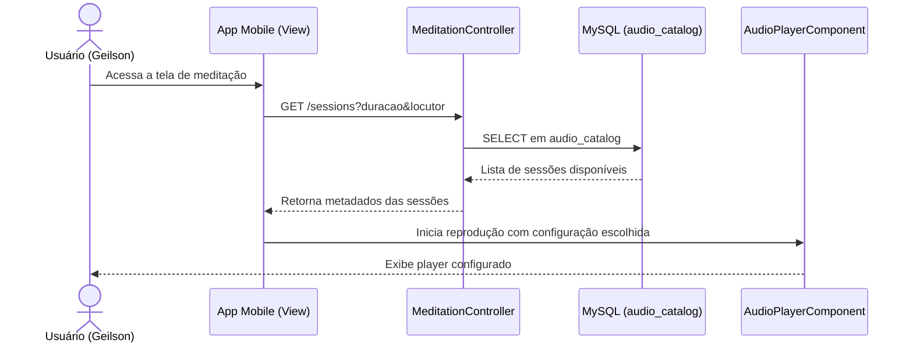
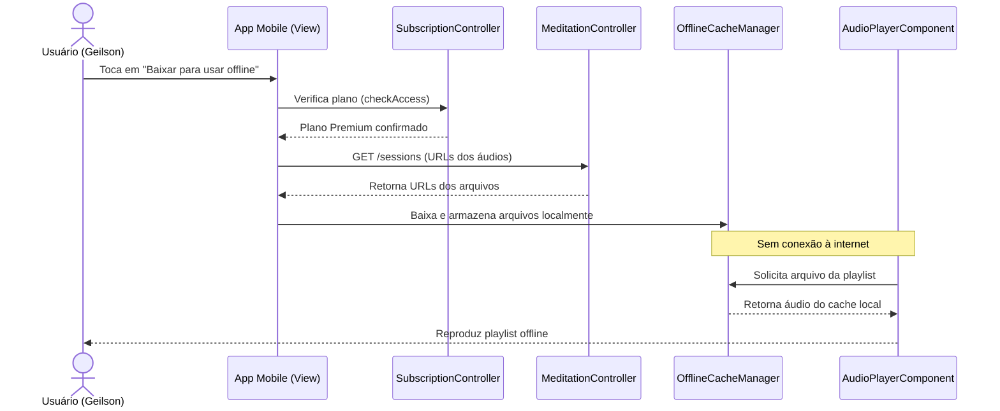
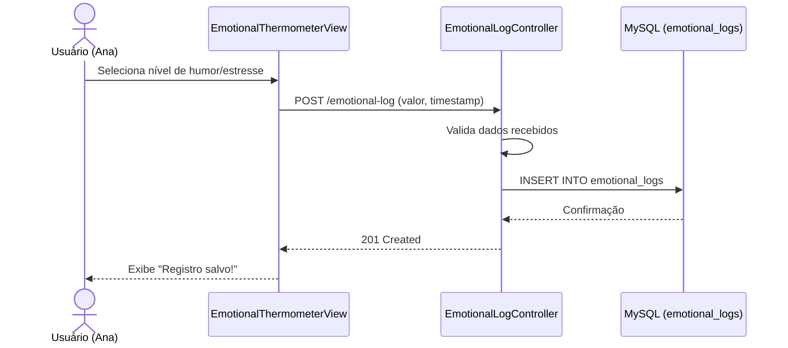
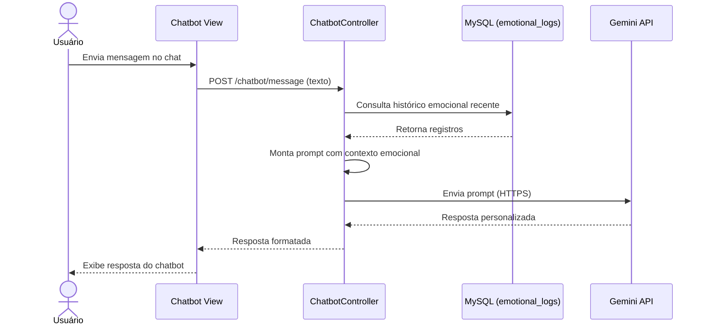
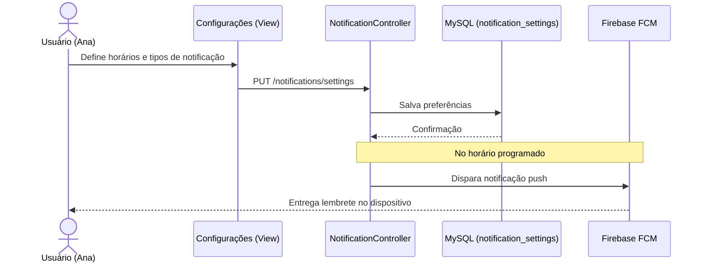
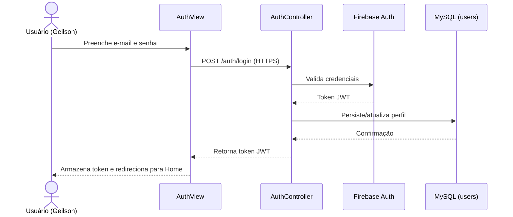
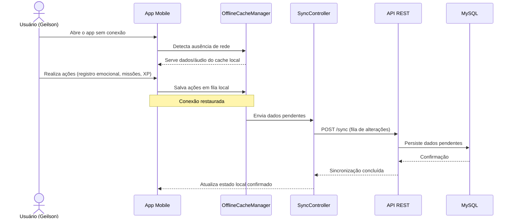

# 🔗 RASTREABILIDADE COM HISTÓRIAS DO USUÁRIO — SLOW DOWN
*Trabalho Prático II — Engenharia de Software A*

  

| Campo | Informação |
|:---|:---|
| **Responsável** | Felipe Rangel |
| **Projeto** | SlowDown |
| **Nível C4 de Referência** | Contexto (N1), Containers (N2), Componentes (N3) |
| **Status da Entrega** | Concluído |

---

## 1. OBJETIVO

Esta seção demonstra, de forma clara e verificável, como as **decisões arquiteturais do SlowDown** estão diretamente relacionadas às **Histórias de Usuário definidas no TP1**. Para cada história relevante, identificamos em quais diagramas C4 ela pode ser rastreada e detalhamos o fluxo de execução passo a passo dentro da arquitetura — tanto em forma de tabela quanto em **diagramas de sequência Mermaid**, que tornam visível o caminho percorrido pela requisição entre View, Controller, Model e sistemas externos.

O critério de seleção priorizou as histórias de **prioridade Alta (🔥)** e aquelas que motivaram diretamente escolhas arquiteturais específicas — como a adoção de serviços externos, o modo offline e a integração biométrica.

---

## 2. TABELA GERAL DE RASTREABILIDADE

A tabela abaixo apresenta o mapeamento entre cada História de Usuário e os elementos arquiteturais que a suportam.

| ID | História (resumo) | Prioridade | Container Principal | Componente Principal | Sistema Externo | Diagrama C4 |
|:---|:---|:---:|:---|:---|:---|:---|
| US-01 | Sessões de meditação guiada configuráveis | 🔥 Alta | App Mobile (Flutter) | AudioPlayerComponent / MeditationController | — | N2, N3 |
| US-02 | Download de playlists para uso offline | 🔥 Alta | App Mobile (Flutter) | OfflineCacheManager / SyncController | — | N2, N3 |
| US-03 | Pet virtual personalizável com nome | 🟡 Média | App Mobile + API REST | XPEngine / Pet | — | N2, N3 |
| US-04 | Monitoramento de frequência cardíaca | 🟡 Média | App Mobile (Flutter) | BiometricSensorComponent | Google Fit API | N1, N2 |
| US-05 | Navegação por comandos de voz | 🟡 Média | App Mobile (Flutter) | VoiceInputComponent | Google Speech-to-Text | N1, N2 |
| US-06 | Registro diário do estado emocional | 🔥 Alta | App Mobile + API REST | EmotionalLogController | — | N2, N3 |
| US-07 | Insights personalizados via termômetro emocional | 🔥 Alta | API REST (Node.js) | InsightEngine / ChatbotController | Gemini API | N1, N2, N3 |
| US-08 | Chatbot de incentivo personalizado | 🔥 Alta | API REST (Node.js) | ChatbotController | Gemini API | N1, N2, N3 |
| US-09 | Mini games antiestresse | 🔥 Alta | App Mobile (Flutter) | MiniGameComponent / MissionController | — | N2, N3 |
| US-10 | Relatório gráfico de evolução emocional | 🟡 Média | App Mobile + API REST | EmotionalLogController / MySQL | — | N2, N3 |
| US-11 | Acompanhar pessoa próxima em sofrimento | 🟡 Média | API REST (Node.js) | NotificationController (parcial — funcionalidade de rede de apoio prevista em versões futuras) | Firebase FCM | N2, N3 |
| US-12 | Emblemas digitais por metas de autocuidado | 🔥 Alta | API REST (Node.js) | AchievementController | — | N2, N3 |
| US-13 | Missões diárias e acúmulo de XP | 🔥 Alta | API REST (Node.js) | MissionController / XPEngine | — | N2, N3 |
| US-14 | Onboarding guiado ao instalar o app | 🔥 Alta | App Mobile (Flutter) | OnboardingFlow | — | N2 |
| US-15 | Notificações personalizadas | 🔥 Alta | API REST (Node.js) | NotificationController | Firebase FCM | N1, N2, N3 |
| US-16 | Criar conta e fazer login | 🔥 Alta | App Mobile + API REST | AuthController | Firebase Auth | N1, N2, N3 |
| US-17 | Visualizar e assinar plano premium | 🟡 Média | App Mobile + API REST | SubscriptionController | Stripe API | N1, N2 |
| US-18 | Experiências de áudio narradas / paisagens sonoras | 🔥 Alta | App Mobile (Flutter) | AudioPlayerComponent / MeditationController | — | N2, N3 |
| US-19 | Funcionalidades essenciais em modo offline | 🔥 Alta | App Mobile (Flutter) | OfflineCacheManager / SyncController | — | N2, N3 |

> **Nota:** os componentes `MeditationController` e `SyncController`, referenciados nesta tabela e nos fluxos abaixo, foram formalizados como componentes da API REST na Seção 4 de `5-c4-componentes.md`, garantindo a rastreabilidade entre este documento e o Nível 3 do modelo C4.

---

## 3. RASTREABILIDADE DETALHADA POR HISTÓRIA

Para cada história, apresentamos: o extrato da HU, sua evidência nos diagramas C4, um **diagrama de sequência** com o fluxo de execução e, quando aplicável, a tabela passo a passo correspondente.

---

### US-01 — Sessões de Meditação Guiada

> **História:** *"Enquanto Geilson (Premium), desejo acessar sessões de meditação guiada com duração e locutor configuráveis, para reduzir meu nível de estresse durante pausas no trabalho."*

**Evidência no Modelo C4:**

| Nível | Localização |
|:---|:---|
| **N2 — Containers** | Container: App Mobile (Flutter) → chama API REST para buscar metadados das sessões |
| **N3 — Componentes** | Componente: `AudioPlayerComponent` (reprodução); `MeditationController` (seleção e configuração) |

**Figura 1 — Sequência de seleção e reprodução de uma sessão de meditação guiada (US-01).**

| Etapa | Ação |
|:---:|:---|
| 1 | O usuário acessa a tela de meditação no App Mobile (View) |
| 2 | O App envia requisição `GET /sessions` com parâmetros de duração e locutor para a API REST |
| 3 | O `MeditationController` (Controller) recebe a requisição e consulta o MySQL |
| 4 | O MySQL (Model) retorna os dados das sessões disponíveis |
| 5 | A API REST retorna os metadados ao App Mobile |
| 6 | O `AudioPlayerComponent` inicia a reprodução local do áudio |
| 7 | A tela exibe o player configurado ao usuário |

---

### US-02 — Playlists Offline

> **História:** *"Enquanto Geilson (Premium), desejo baixar playlists da curadoria de relaxamento para ouvir músicas de forma contínua em locais sem acesso à internet."*

**Evidência no Modelo C4:**

| Nível | Localização |
|:---|:---|
| **N2 — Containers** | Container: App Mobile → gerencia cache local; API REST → autoriza download |
| **N3 — Componentes** | Componente: `OfflineCacheManager` (Flutter) — responsável por armazenar e servir arquivos localmente |

**Figura 2 — Sequência de download e reprodução offline de uma playlist (US-02).**

| Etapa | Ação |
|:---:|:---|
| 1 | O usuário seleciona uma playlist e toca "Baixar para usar offline" |
| 2 | O App Mobile verifica se o usuário possui plano Premium via `SubscriptionController` |
| 3 | A API REST autoriza o download e retorna as URLs dos arquivos de áudio |
| 4 | O `OfflineCacheManager` baixa e armazena os arquivos no armazenamento local do dispositivo |
| 5 | Quando o usuário está sem internet, o `AudioPlayerComponent` serve os arquivos do cache local |
| 6 | A experiência de reprodução é idêntica ao modo online |

---

### US-06 — Registro Diário do Estado Emocional

> **História:** *"Enquanto Ana (Acessibilidade), desejo registrar meu estado emocional diariamente, para acompanhar meu progresso e identificar padrões de esgotamento ao longo do tempo."*

**Evidência no Modelo C4:**

| Nível | Localização |
|:---|:---|
| **N2 — Containers** | App Mobile captura o registro → API REST valida e persiste → MySQL armazena histórico |
| **N3 — Componentes** | `EmotionalThermometerView` (View) → `EmotionalLogController` (Controller) → tabela `emotional_logs` (Model) |

**Figura 3 — Sequência de registro diário do estado emocional (US-06).**

| Etapa | Ação |
|:---:|:---|
| 1 | O usuário interage com o termômetro emocional na tela principal (View) |
| 2 | Seleciona o nível de humor/estresse e confirma o registro |
| 3 | O App Mobile envia `POST /emotional-log` com o valor e timestamp para a API REST |
| 4 | O `EmotionalLogController` valida os dados e persiste no MySQL |
| 5 | O MySQL registra o log na tabela `emotional_logs` associado ao `user_id` |
| 6 | A API retorna confirmação ao App Mobile |
| 7 | A View exibe feedback visual ao usuário (ex: "Registro salvo!") |

---

### US-07 e US-08 — Insights Personalizados e Chatbot

> **US-07:** *"Desejo receber insights personalizados com base no meu termômetro emocional…"*
> **US-08:** *"Desejo interagir com um chatbot que ofereça incentivo personalizado…"*

Estas duas histórias são rastreadas juntas pois **compartilham o mesmo componente arquitetural** (`ChatbotController`) e o mesmo sistema externo (Gemini API).

**Evidência no Modelo C4:**

| Nível | Localização |
|:---|:---|
| **N1 — Contexto** | SlowDown ↔ Gemini API (seta: *Consome*) |
| **N2 — Containers** | API REST → consome Gemini API com contexto emocional do usuário |
| **N3 — Componentes** | `InsightEngine` (gera insights automáticos); `ChatbotController` (processa interações conversacionais) |

**Figura 4 — Sequência de interação com o chatbot de incentivo, com contexto emocional vindo de `emotional_logs` e resposta gerada pela Gemini API (US-07 / US-08).**

**Fluxo de execução (US-08 — Chatbot):**

| Etapa | Ação |
|:---:|:---|
| 1 | O usuário digita ou fala uma mensagem na tela do chatbot (View) |
| 2 | O App Mobile envia `POST /chatbot/message` com o texto e histórico emocional recente |
| 3 | O `ChatbotController` monta o prompt com o contexto do usuário (registros do MySQL) |
| 4 | A API REST envia o prompt à **Gemini API** via HTTPS |
| 5 | A Gemini retorna a resposta personalizada |
| 6 | O Controller formata a resposta e a devolve ao App Mobile |
| 7 | A View exibe a resposta do chatbot ao usuário |

Para a US-07, o fluxo é análogo, porém disparado automaticamente pelo `InsightEngine` (e não por mensagem do usuário): o `EmotionalLogController` aciona `InsightEngine.generateInsight(userId)`, que consulta `emotional_logs`, opcionalmente chama a Gemini API para análises mais elaboradas e persiste o resultado como `Insight`.

---

### US-15 — Notificações Personalizadas

> **História:** *"Enquanto Ana, desejo configurar notificações personalizadas do app, para receber lembretes de práticas de bem-estar nos horários que melhor se adequam à minha rotina."*

**Evidência no Modelo C4:**

| Nível | Localização |
|:---|:---|
| **N1 — Contexto** | SlowDown ↔ Firebase FCM (seta: *Recebe alertas de*) |
| **N2 — Containers** | API REST agenda e dispara notificações via FCM |
| **N3 — Componentes** | `NotificationController` — recebe configurações do usuário e programa envios via FCM |

**Figura 5 — Sequência de configuração e disparo de notificações personalizadas via Firebase FCM (US-15).**

| Etapa | Ação |
|:---:|:---|
| 1 | O usuário configura horários e tipos de notificação nas Configurações (View) |
| 2 | O App envia `PUT /notifications/settings` para a API REST |
| 3 | O `NotificationController` salva as preferências no MySQL |
| 4 | No horário programado, o Controller dispara a notificação via **Firebase FCM** |
| 5 | O FCM entrega a notificação push ao dispositivo do usuário |
| 6 | O usuário recebe o lembrete mesmo com o app fechado |

---

### US-16 — Criar Conta e Fazer Login

> **História:** *"Enquanto Geilson, desejo criar uma conta e fazer login no aplicativo, para acessar minhas informações pessoais e histórico de bem-estar com segurança."*

**Evidência no Modelo C4:**

| Nível | Localização |
|:---|:---|
| **N1 — Contexto** | SlowDown ↔ Firebase Auth (seta: *Consome*) |
| **N2 — Containers** | App Mobile → API REST → Firebase Auth / MySQL |
| **N3 — Componentes** | `AuthController` — gerencia fluxo de autenticação; `UserModel` — persiste perfil no MySQL |

**Figura 6 — Sequência de criação de conta / login, com validação no Firebase Auth e persistência do perfil em `users` (US-16).**

| Etapa | Ação |
|:---:|:---|
| 1 | O usuário preenche e-mail e senha na tela de Login/Cadastro (View) |
| 2 | O App Mobile envia as credenciais à API REST via `POST /auth/login` (HTTPS) |
| 3 | O `AuthController` repassa as credenciais ao **Firebase Auth** |
| 4 | O Firebase Auth valida e retorna um token JWT |
| 5 | O Controller persiste ou atualiza os dados de perfil no MySQL |
| 6 | O token é retornado ao App Mobile |
| 7 | O App armazena o token localmente e redireciona para a tela principal |

---

### US-19 — Modo Offline Total

> **História:** *"Enquanto Geilson, desejo utilizar todas as funcionalidades essenciais do app em modo offline, para não depender de conexão para cuidar da minha saúde mental."*

Esta é a história de **maior impacto arquitetural** do SlowDown. Ela justifica diretamente a decisão de manter o `OfflineCacheManager` como componente dedicado dentro do App Mobile e motivou a separação clara entre dados locais e dados sincronizados.

**Evidência no Modelo C4:**

| Nível | Localização |
|:---|:---|
| **N2 — Containers** | App Mobile — possui camada de cache local independente da API REST |
| **N3 — Componentes** | `OfflineCacheManager` — gerencia dados em cache; `SyncController` — sincroniza quando a conexão é restaurada |

**Funcionalidades disponíveis offline:**

| Funcionalidade | Estratégia |
|:---|:---|
| Registro emocional | Salvo localmente; sincronizado quando online |
| Reprodução de áudio | Arquivos baixados previamente pelo `OfflineCacheManager` |
| Missões diárias | Carregadas do cache; XP salvo localmente até sincronização |
| Pet virtual | Estado local atualizado; sincronizado com o servidor posteriormente |

**Figura 7 — Sequência de uso em modo offline e sincronização posterior via `SyncController` (US-19).**

| Etapa | Ação |
|:---:|:---|
| 1 | O usuário abre o app sem conexão à internet |
| 2 | O App Mobile detecta ausência de rede e aciona o `OfflineCacheManager` |
| 3 | As funcionalidades essenciais são servidas a partir dos dados em cache local |
| 4 | Ações do usuário (registros, XP, etc.) são salvas em fila local |
| 5 | Quando a conexão é restaurada, o `SyncController` envia os dados pendentes à API REST |
| 6 | A API persiste os dados no MySQL e retorna confirmação de sincronização |

---

## 4. DECISÕES ARQUITETURAIS MOTIVADAS PELAS HISTÓRIAS DE USUÁRIO

A tabela abaixo consolida as decisões mais relevantes da arquitetura do SlowDown e as HUs que as originaram diretamente.

| Decisão Arquitetural | Motivação | HUs Relacionadas |
|:---|:---|:---|
| **Adoção do Flutter** | Necessidade de suporte offline nativo, cache de áudio e integração com sensores Android | US-01, US-02, US-04, US-05, US-18, US-19 |
| **API REST com Node.js + Express** | Processamento centralizado de regras de negócio complexas (XP, Índice de Estresse, chatbot) | US-07, US-08, US-12, US-13 |
| **Integração com Gemini API** | Necessidade de respostas personalizadas e adaptadas ao histórico emocional do usuário | US-07, US-08 |
| **Firebase Auth** | Autenticação segura sem armazenamento de senhas em texto puro | US-16 |
| **Firebase FCM** | Entrega de notificações push mesmo com o app em background | US-11, US-15 |
| **Google Fit API** | Captura padronizada de dados biométricos (BPM) via sensores do dispositivo Android | US-04 |
| **Google Speech-to-Text** | Acessibilidade para usuários com mãos ocupadas ou limitações motoras | US-05 |
| **Stripe API (Sandbox)** | Gestão segura de assinaturas do plano Premium no ambiente de MVP | US-17 |
| **MySQL como banco relacional** | Necessidade de integridade referencial entre usuários, registros emocionais, missões e conquistas | US-06, US-10, US-12, US-13, US-16 |
| **OfflineCacheManager + SyncController dedicados** | Garantia de funcionamento sem internet para o público-alvo em áreas remotas, com sincronização posterior consistente | US-02, US-18, US-19 |
| **Padrão MVC** | Separação clara entre interface, lógica de negócio e dados para facilitar o desenvolvimento colaborativo | Todas as HUs |

---

Desenvolvido para a disciplina de Engenharia de Software A · ICET/UFAM 
Professor: Dr. Andrey Rodrigues

